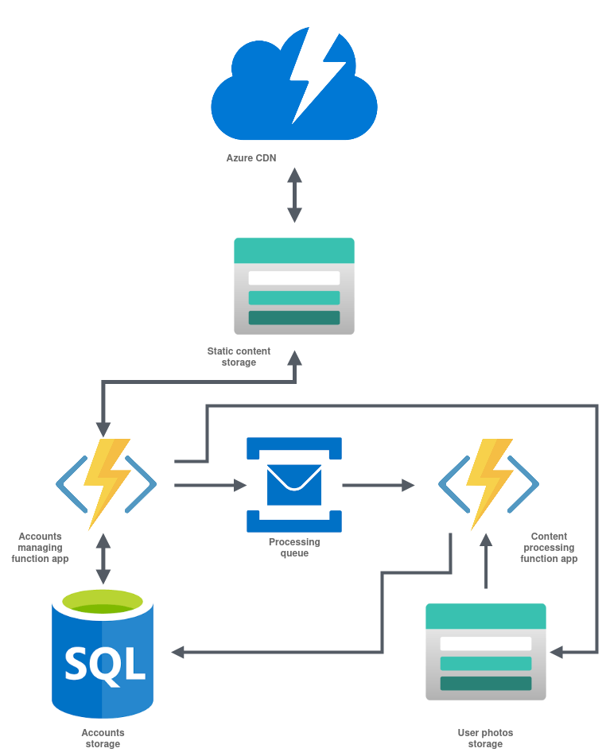

# TRIGGERGRAM

An [Instagram](https://www.instagram.com)-like social network for uploading and sharing photos, that is build in top of the serverless architecture using **MS Azure** cloud provider.

## Covered Azure services

 - [Functions](https://docs.microsoft.com/en-us/azure/azure-functions/);
 - [SignalR service](https://docs.microsoft.com/en-us/azure/azure-signalr/);
 - [Blob Storage](https://docs.microsoft.com/en-us/azure/storage/);
 - [Service Bus](https://docs.microsoft.com/en-us/azure/service-bus-messaging/service-bus-messaging-overview);

## Service description

| Service             | Functional                                                                                                                          |
|---------------------|-------------------------------------------------------------------------------------------------------------------------------------|
| Accounts management |  1) Authentication and authorization;  2) C.R.U.D. on accounts;  3) User content management;  4) User activity management; |
| Content processing  |  1) Auto-tagging user images using computer vision technologies;  2) Semantic analysis of user comments;                         |

## Architecture

